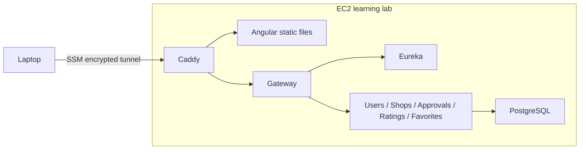

# On-demand AWS learning lab

This is a deployment template, not a record of a completed AWS deployment.
No AWS resources have been created by this implementation pass.

For the complete command-by-command setup, secure access, update, stop and
teardown procedure, follow [AWS_DEPLOYMENT_GUIDE.md](AWS_DEPLOYMENT_GUIDE.md).
This document explains the architecture and cost boundaries.

The lab uses one EC2 VM with Docker Compose. It has no inbound security-group
rules. Systems Manager provides an encrypted tunnel from your laptop to the
frontend; Caddy forwards `/api` to the gateway, which discovers domain services
through Eureka. Each domain uses its own PostgreSQL database on the VM.

## Cost boundaries

- Start only when learning/demoing; stop afterward. The installed systemd timer
  stops the instance two hours after **every boot**, including the initial boot.
- Stop removes compute charges, but the 40 GB EBS volume remains billable.
  Snapshots, data transfer, logs and any other resources you create may also cost.
- A temporary public IPv4 supports outbound package downloads and SSM while the
  instance runs. There is no Elastic IP, NAT Gateway, load balancer or RDS.
- T3 uses standard CPU credits to avoid unlimited-mode surplus credit charges;
  exhausted credits can slow builds. Budget alerts are notifications, not a cap.
- Review your region's [EC2 prices](https://aws.amazon.com/ec2/pricing/on-demand/),
  [EBS prices](https://aws.amazon.com/ebs/pricing/) and
  [IPv4 prices](https://aws.amazon.com/vpc/pricing/) before creating the stack.
  Free-tier coverage is not assumed.

## One-time setup

1. Enable MFA and configure AWS CLI with an SSO/profile session. Never use root
   access keys. Set a small AWS Budget alert in your account.
2. Choose your region. Review `infra/aws/lab.yml`: t3.large has memory for this
   multi-JVM lab; a micro instance is not a realistic target for all services.
3. Validate the template with `aws cloudformation validate-template
   --template-body file://infra/aws/lab.yml --region REGION`.
4. Creation incurs charges. When ready, deploy with `aws cloudformation deploy
   --template-file infra/aws/lab.yml --stack-name street-smart-lab
   --capabilities CAPABILITY_IAM --region REGION`.
5. Get the instance ID from stack outputs. Open a Session Manager shell after
   SSM is ready; inspect `/var/log/cloud-init-output.log` for bootstrap failures.
   See [AWS's SSM prerequisites](https://docs.aws.amazon.com/systems-manager/latest/userguide/session-manager-getting-started.html).
6. Copy/clone your reviewed repository to `/opt/street-smart`. Do not put a Git
   access token in a clone URL or cloud-init. Generate fresh deployment secrets
   on that host; `.env` must have mode 600 and must never be committed. The
   existing `backend.ps1 -Action Init` creates the single private `.env` file
   when PowerShell is installed; alternatively create that file with independently
   generated `openssl rand -base64 48` values. Keep SMS disabled and the Maps
   key empty.
7. In that checkout, run `sudo docker compose -f compose.yml -f compose.lab.yml
   up -d --build --wait`. First compilation may take several minutes.
8. Install AWS's Session Manager plugin on your laptop, then run
   `./scripts/aws-lab.ps1 -Action Connect -InstanceId i-... -Region REGION`.
   Open `http://localhost:8088`; traffic crosses the encrypted SSM tunnel.

## Each session

Use `aws-lab.ps1 -Action Start`, wait for SSM, then `-Action Connect`. Containers
restart with Docker. Use `-Action Stop` when done, then `-Action Status` to verify
the instance is stopped. The automatic timer is a fallback, not a billing cap.
It can interrupt a build or demo; save work before the two-hour deadline.

## Teardown and backups

Export PostgreSQL backups before deleting the stack. `scripts/backup.ps1`
creates per-database custom-format dumps on the machine where the script runs.
Copy them off the VM and encrypt them. Test restoration into an isolated database
using `pg_restore --exit-on-error`; do not restore over the live app as a test.

Deleting the CloudFormation stack terminates EC2 and deletes its root volume,
including databases and images. Do this only after verifying off-host backups.
Verify the stack deletion completes and check the billing/resource inventory for
leftover snapshots or manually created resources. Stopping is reversible;
deleting the stack destroys its local data.

## Later learning stages

For a public demo, add a domain and use `compose.production.yml` with Caddy TLS.
For managed-service learning, move images to ECR, secrets to Secrets Manager,
then PostgreSQL to RDS and workloads to ECS. Those changes have different cost
and availability tradeoffs; the current lab deliberately runs on one machine.
