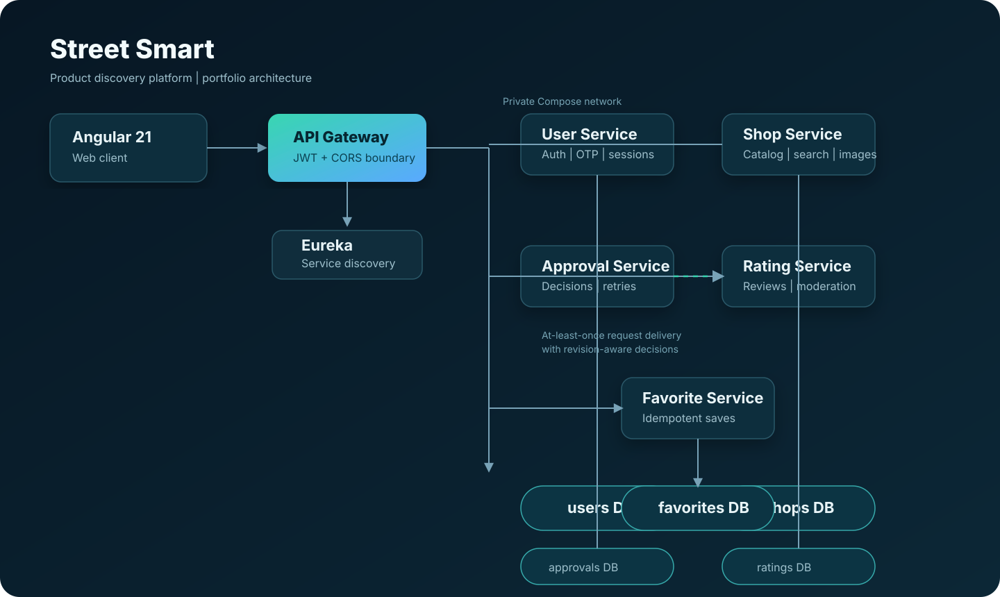
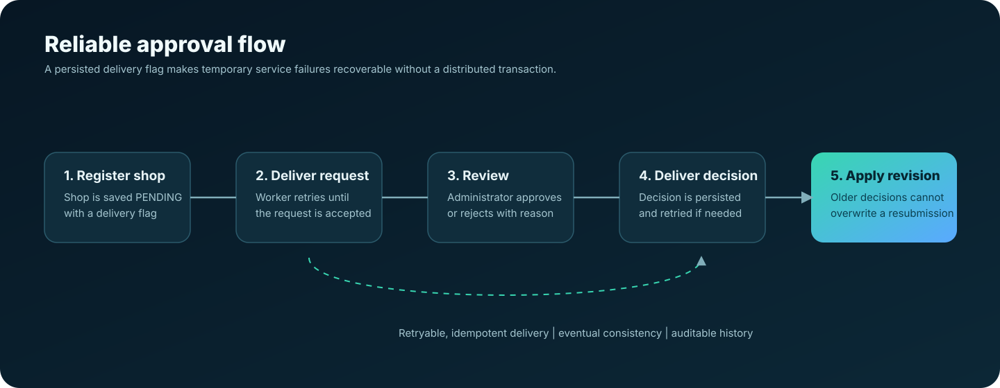

# Street Smart - Engineering Case Study

> A product-first local-commerce platform that helps customers find items at
> nearby shops, while giving shopkeepers catalogue controls and administrators
> a reviewable onboarding and moderation workflow.

| Project details | |
| --- | --- |
| Stack | Angular 21, Java 17, Spring Boot 3.5, Spring Cloud, PostgreSQL, Docker Compose |
| Architecture | Gateway + six independently owned backend domains + service discovery |
| Primary users | Customers, shopkeepers, administrators |
| Current delivery | Local Docker environment and an optional on-demand AWS EC2 lab |
| Source of truth | This repository and its automated checks; no public production deployment is claimed |

## The problem

Searching for a **shop name** does not answer the customer question: "Where can
I buy this product near me?" Street Smart makes the product/shop pair the core
discovery result. A customer can combine product name, category, availability,
price range and optional radius filters, then open the matching shop to review
details, ratings, images and location.

The project also models the two operational workflows often missing from small
marketplace demos: shopkeeper onboarding and content moderation. Shopkeepers
submit and correct registrations; administrators decide them. Customers can
report reviews; administrators preserve the report record even when removing
the reported review.

## What I built

- Product-first search with backend filtering, pagination and optional fuzzy
  matching; approved shops only are discoverable to customers.
- Role-aware customer, shopkeeper and administrator journeys.
- JWT authentication, phone-verification integration, rate-limited auth/OTP
  endpoints and server-derived ownership checks.
- Managed sessions: list active sessions, revoke a selected session or sign out
  every device; sensitive profile changes revoke sessions transactionally.
- Shop registration with retryable approval delivery, idempotent handling and
  revision-aware decisions.
- Catalogues, validated image upload/preview/delete, favourites, ratings and
  an administrator review-report queue.
- Containerized local operation, Flyway database migrations, health checks,
  CI workflows and an on-demand AWS learning lab.

## Architecture

The gateway is the single host-published API boundary. It applies JWT
verification and explicit-origin CORS before routing to domain services. Each
business domain owns its PostgreSQL database; services do not write another
domain's tables. Eureka is used for service discovery inside the Compose
network.

The image below is deliberately a logical view, not a claim of multi-region or
high-availability infrastructure.

### Key design choices

| Decision | Why it matters |
| --- | --- |
| Product search belongs to Shop Service | Search results return the product and the shop that stocks it, instead of forcing a shop-name-first experience. |
| Per-service database ownership | Keeps responsibility clear and prevents cross-service table writes. |
| Signed JWT subject determines ownership | The backend never trusts a client-supplied user ID for protected actions. |
| Session validation fails closed | A revoked session cannot be accepted just because a downstream service is temporarily uncertain. |
| Retryable approval delivery | A temporary dependency outage does not discard a shopkeeper's approval request. |
| Review snapshots on reports | Moderation has useful evidence even after a violating review is removed. |

## A reliability problem worth discussing

The approval workflow crosses two domains, so it cannot rely on a single
database transaction. Instead, Street Smart persists the local change and a
pending-delivery flag together. A worker retries the request until the receiving
service accepts it. Decisions include a revision, so an old delayed decision
cannot overwrite a shopkeeper's newer resubmission.

This is **at-least-once delivery and eventual consistency**, not exactly-once
delivery or a distributed transaction. That distinction is intentional and
documented.

## Security and operational posture

- Domain services independently validate signed JWTs, including issuer, expiry
  and audience.
- Gateway-only host exposure keeps domain ports and Eureka private to Compose.
- Internal approval routes require a separate service credential.
- Flyway versions schema changes; validation errors use consistent 4xx/5xx API
  responses without exposing internal exception messages.
- Images are restricted to JPEG/PNG, maximum 5 MB and 16 megapixels, with
  generated filenames and authenticated owner controls.
- A root private `.env` holds local secrets. The AWS lab documentation uses
  private SSM access and an automatic stop timer to avoid always-on cloud cost.

For a production system, I would replace the local admin bootstrap secret with
managed secrets and MFA, use workload identities/asymmetric signing across
trust boundaries, store images in object storage, and add managed backup and
observability services.

## Verification evidence

The latest recorded local verification is in
[FINAL_CODE_VERIFICATION.md](FINAL_CODE_VERIFICATION.md):

- User Service: 19 passing tests
- Rating Service: 6 passing tests
- Shared backend: 3 passing tests
- Angular production build: passing
- Angular ChromeHeadless suite: 57 passing tests
- Local empty-catalogue search baseline: 100 requests with four workers, zero
  failures, p50 70.22 ms and p95 129.46 ms

Those latency figures are a **local regression baseline**, not a production
capacity or scalability claim. The isolated browser acceptance suite also
exists, but should be rerun before recording a demo because its latest final
visual recheck was blocked by an unresponsive local Docker runtime.

## Five-minute demo script

1. Start the stack and show gateway/service health.
2. Log in as a shopkeeper, submit a shop, then log in as an administrator to
   approve it. Explain retryable, revision-aware delivery.
3. Add a product, price, description and image.
4. Log in as a customer; search for the product and combine category, price and
   availability filters. Open the matching shop, favourite it and add a review.
5. Report a review; return as administrator and dismiss or remove it from the
   moderation queue. Explain that evidence is retained after removal.
6. Open Profile and demonstrate individual-session revocation or sign-out-all.

Use test data only. Never show `.env`, service credentials, provider keys or a
real customer phone number in a recording.

## Portfolio-ready copy

### Short project card

**Street Smart - Product Discovery Marketplace**

Built a product-first local-commerce platform with Angular and Spring Boot
microservices. Customers search items across nearby shops; shopkeepers manage
catalogues; administrators handle onboarding and review moderation. Implemented
JWT access control, session revocation, retryable approval delivery, Flyway
migrations, Docker-based operation and automated verification.

### Resume bullets

- Built a Java/Spring Boot and Angular local-commerce platform with a gateway,
  six domain services, independently owned PostgreSQL schemas and Docker-based
  local operation.
- Designed a product-first search API with filters, pagination and optional
  fuzzy matching, plus role-aware customer, shopkeeper and administrator flows.
- Implemented secure session revocation, review-report audit retention and
  retryable, revision-aware approval delivery; backed changes with Flyway
  migrations and automated backend/frontend tests.

## What I would improve next

1. Deploy a small demo environment and record a verified walkthrough.
2. Replace local credential bootstrap with a managed-secret, MFA-protected
   administrator lifecycle.
3. Move image content to object storage and use a CDN for delivery.
4. Add OpenTelemetry tracing, durable metrics storage and alert routing.
5. Add a formal load test with representative catalogue size and concurrent
   users before making performance claims.

## Explore the repository

- [Setup and architecture overview](../README.md)
- [Security and operations](SECURITY_OPERATIONS.md)
- [Frontend design notes](FRONTEND_DESIGN.md)
- [Verification evidence](FINAL_CODE_VERIFICATION.md)
- [On-demand AWS lab](AWS_LAB.md)
