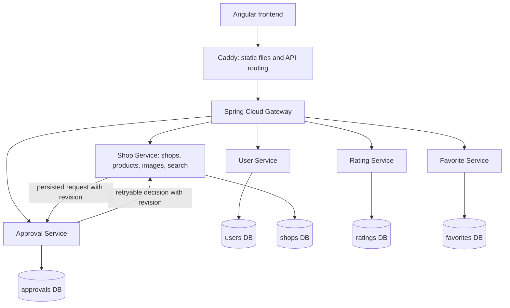

# Street Smart engineering case study

For the portfolio-ready narrative, original diagrams and copy-ready project
summary, see [CASE_STUDY.md](CASE_STUDY.md). This document retains the detailed
demo workflow and architectural notes.

## Problem and users

Customers need to find a product at a nearby shop. Shopkeepers need to maintain
their catalogue, and administrators need to review shop registrations. The main
discovery result is a product/shop pair, not a shop-name match.

## Architecture and decisions

The separate service databases make ownership explicit. Images remain in
PostgreSQL to simplify a small deployment; object storage is a later tradeoff.
Eureka provides service discovery. Domain services verify JWTs independently,
derive ownership from the signed subject, and keep internal APIs behind a
separate credential and private networking.

Approval delivery is at least once. A persisted flag survives a dependency
outage and a worker retries it. Resubmission increments a revision: delayed
decisions from an earlier application cannot change the new application's
status. Approval history preserves the prior reason and administrator identity.
This is eventual consistency, not a distributed transaction.

Product search applies name/category/availability and optional INR price
and radius filters before pagination. A coordinate index helps the latitude
bounding filter; exact spherical distance follows it. This is not PostGIS or a
claim of geographic search performance at large scale.

## Before and after

| Earlier weakness | Implemented behavior |
| --- | --- |
| Shop-oriented discovery | Product/shop results with URL-persisted filters |
| Client identity assumptions | Server-side role and owner checks |
| Incompatible OTP flow | Server challenges and single-use verification proof |
| Dependency failure could lose approval work | Persisted retries and revision checks |
| No owner image controls | Validated upload, authenticated preview and delete |
| Unclear catalogue freshness | Product update timestamps and optional price details |
| Old frontend dependencies | Angular 21 migration and reduced dependency tree |
| Difficult deployment story | Compose plus an on-demand AWS lab template |

## Five-minute demonstration

1. Start the local stack or AWS lab; show its healthy services.
2. Sign in as a shopkeeper, register a shop, then sign in as administrator and
   approve it. Explain that the decision is delivered asynchronously.
3. Add a product with a price and description, and upload a shop image.
4. As a customer, search the product name, filter category and price, open the
   shop, save a favourite and create a review. Refresh to show persistence.
5. Demonstrate rejection, correction and resubmission. Show the regression test
   proving an older decision cannot overwrite the new application.
6. Show verification reports and the on-demand lab stop procedure.

Use test-only accounts and generated credentials. Do not record `.env`, admin
passwords, real customer data or provider keys. Browser screenshots/GIFs must be
captured from an actual verified run; none are fabricated in this document.

## Claims suitable for a resume

- Built a product-discovery application with Angular and Spring Boot services,
  independent data ownership, authenticated APIs and server-side access controls.
- Implemented retryable approval delivery with idempotency, revision checks and
  auditable resubmission to tolerate delayed cross-service requests.
- Added database-backed search filters, Flyway migrations, automated regression
  checks and Docker-based setup; prepared an on-demand EC2 learning deployment.

Use the dated verification reports for test counts. Do not claim a hosted AWS
deployment, high availability, load-test throughput, full browser acceptance or
complete credential rotation until those actions are actually verified.
